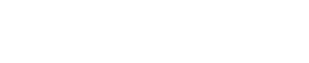
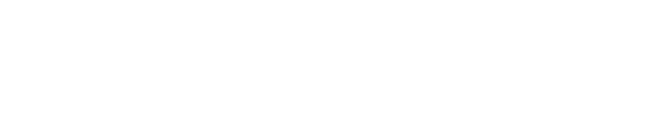
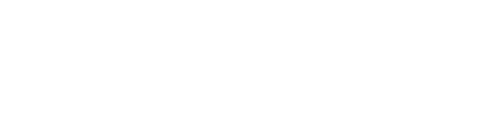
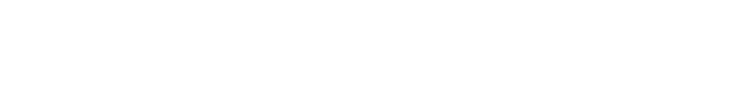
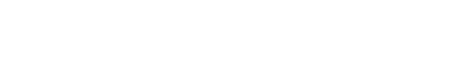

+++
title = "Drawing Git Graphs with Graphviz and Org-Mode"
author = ["Correl Roush"]
date = 2015-07-12T00:00:00-04:00
keywords = ["emacs", "org-mode", "themes"]
tags = ["emacs", "org-mode", "git", "graphviz"]
draft = false
+++

<style type="text/css">
 svg text {
     fill: white;
 }
 svg path,
 svg polygon,
 svg ellipse {
     stroke: white;
 }
</style>

Digging through Derek Feichtinger's [org-babel examples](https://github.com/dfeich/org-babel-examples) (which I came
across via [irreal.org](http://irreal.org/blog/?p=4162)), I found he had some great examples of
displaying git-style graphs using graphviz. I thought it'd be a fun
exercise to generate my own graphs based on his graphviz source using
elisp, and point it at actual git repos.


## Getting Started {#getting-started}

I started out with the goal of building a simple graph showing a
mainline branch and a topic branch forked from it and eventually
merged back in.

Using Derek's example as a template, I described 5 commits on a master
branch, plus two on a topic branch.

<a id="code-snippet--git-graphs-example"></a>


The resulting image looks like this:




### Designing the Data Structure {#designing-the-data-structure}

The first thing I needed to do was describe my data structure. Leaning
on my experiences reading and working through [SICP](https://www.google.com/url?sa=t&rct=j&q=&esrc=s&source=web&cd=1&cad=rja&uact=8&ved=0CB8QFjAA&url=https%3A%2F%2Fmitpress.mit.edu%2Fsicp%2F&ei=lH6gVau5OIGR-AG8j7yACQ&usg=AFQjCNHTCXQK7qN-kYibdy%5FMqRBWxlr8og&sig2=Lu9WIhyuTJS92e8hxne0Aw&bvm=bv.97653015,d.cWw), I got to work
building a constructor function, and several accessors.

I decided to represent each node on a graph with an id, a list of
parent ids, and a group which will correspond to the branch on the
graph the commit belongs to.

```emacs-lisp
(defun git-graph/make-node (id &optional parents group)
  (list id parents group))

(defun git-graph/node-id (node)
  (nth 0 node))

(defun git-graph/node-parents (node)
  (nth 1 node))

(defun git-graph/node-group (node)
  (nth 2 node))
```


### Converting the structure to Graphviz {#converting-the-structure-to-graphviz}

Now that I had my data structures sorted out, it was time to step
through them and generate the graphviz source that'd give me the
nice-looking graphs I was after.

The graph is constructed using the example above as a template. The
nodes are defined first, followed by the edges between them.

<a id="code-snippet--git-graph-to-graphviz"></a>
```emacs-lisp
(defun git-graph/to-graphviz (id nodes)
  (string-join
   (list
    (concat "digraph " id " {")
    "bgcolor=\"transparent\";"
    "rankdir=\"LR\";"
    "node[width=0.15,height=0.15,shape=point,fontsize=8.0,color=white,fontcolor=white];"
    "edge[weight=2,arrowhead=none,color=white];"
    (string-join
     (-map #'git-graph/to-graphviz-node nodes)
     "\n")
     (string-join
      (-uniq (-flatten (-map
                        (lambda (node) (git-graph/to-graphviz-edges node nodes))
                        nodes)))
      "\n")
      "}")
   "\n"))
```

For the sake of readability, I'll format the output:

<a id="code-snippet--git-graph-to-graphviz"></a>
```emacs-lisp
(defun git-graph/to-graphviz-pretty (id nodes)
  (with-temp-buffer
    (graphviz-dot-mode)
    (insert (git-graph/to-graphviz id nodes))
    (indent-region (point-min) (point-max))
    (buffer-string)))
```

Each node is built, setting its group attribute when applicable.

```emacs-lisp
(defun git-graph/to-graphviz-node (node)
  (let ((node-id (git-graph/to-graphviz-node-id
                  (git-graph/node-id node))))
    (concat node-id
            (--if-let (git-graph/node-group node)
                (concat "[group=\"" it "\"]"))
            ";")))
```

Graphviz node identifiers are quoted to avoid running into issues with
spaces or other special characters.

<a id="code-snippet--git-graph-to-graphviz-nodes"></a>
```emacs-lisp
(defun git-graph/to-graphviz-node-id (id)
  (format "\"%s\"" id))
```

For each node, an edge is built connecting the node to each of its
parents.

<a id="code-snippet--git-graph-to-graphviz-edges"></a>
```emacs-lisp
(defun git-graph/to-graphviz-edges (node &optional nodelist)
  (let ((node-id (git-graph/node-id node))
        (parents (git-graph/node-parents node))
        (node-ids (-map #'git-graph/node-id nodelist)))
    (-map (lambda (parent)
            (unless (and nodelist (not (member parent node-ids)))
              (git-graph/to-graphviz-edge node-id parent)))
          parents)))

(defun git-graph/to-graphviz-edge (from to)
  (concat
   (git-graph/to-graphviz-node-id to)
   " -> "
   (git-graph/to-graphviz-node-id from)
   ";"))
```

With that done, the simple graph above could be generated with the
following code:

<a id="code-snippet--git-example"></a>
```emacs-lisp
(git-graph/to-graphviz-pretty
 "example"
 (list (git-graph/make-node 1 nil "master")
       (git-graph/make-node 2 '(1) "master")
       (git-graph/make-node 3 '(2) "master")
       (git-graph/make-node 4 '(3 7) "master")
       (git-graph/make-node 5 '(4) "master")
       (git-graph/make-node 6 '(2) "branch")
       (git-graph/make-node 7 '(6) "branch")))
```

Which generates the following graphviz source:

<a id="code-snippet--git-graphs-generated-example"></a>
```dot
nil
```

The generated image matches the example exactly:




## Adding Labels {#adding-labels}

The next thing my graph needed was a way of labeling nodes. Rather
than trying to figure out some way of attaching a separate label to a
node, I decided to simply draw a labeled node as a box with text.






### Updating the Data Structure {#updating-the-data-structure}

I updated my data structure to support an optional label applied to a
node. I opted to store it in an associative list alongside the group.

<a id="code-snippet--git-graph-structure"></a>
```emacs-lisp
(defun git-graph/make-node (id &optional parents options)
  (list id parents options))

(defun git-graph/node-id (node)
  (nth 0 node))

(defun git-graph/node-parents (node)
  (nth 1 node))

(defun git-graph/node-group (node)
  (cdr (assoc 'group (nth 2 node))))

(defun git-graph/node-label (node)
  (cdr (assoc 'label (nth 2 node))))
```


### Updating the Graphviz node generation {#updating-the-graphviz-node-generation}

The next step was updating the Graphviz generation functions to handle
the new data structure, and set the shape and label attributes of
labeled nodes.

<a id="code-snippet--git-graph-to-graphviz-nodes"></a>
```emacs-lisp
(defun git-graph/to-graphviz-node (node)
  (let ((node-id (git-graph/to-graphviz-node-id (git-graph/node-id node))))
    (concat node-id
            (git-graph/to-graphviz-node--attributes node)
            ";")))

(defun git-graph/to-graphviz-node--attributes (node)
  (let ((attributes (git-graph/to-graphviz-node--compute-attributes node)))
    (and attributes
         (concat "["
                 (mapconcat (lambda (pair)
                              (format "%s=\"%s\""
                                      (car pair) (cdr pair)))
                            attributes
                            ", ")
                 "]"))))

(defun git-graph/to-graphviz-node--compute-attributes (node)
  (-filter #'identity
           (append (and (git-graph/node-group node)
                        (list (cons 'group (git-graph/node-group node))))
                   (and (git-graph/node-label node)
                        (list (cons 'shape 'box)
                              (cons 'label (git-graph/node-label node)))))))
```

I could then label the tips of each branch:

<a id="code-snippet--graph-example-labels"></a>
```emacs-lisp
(git-graph/to-graphviz-pretty
 "labeled"
 (list (git-graph/make-node 1 nil '((group . "master")))
       (git-graph/make-node 2 '(1) '((group . "master")))
       (git-graph/make-node 3 '(2) '((group . "master")))
       (git-graph/make-node 4 '(3 7) '((group . "master")))
       (git-graph/make-node 5 '(4) '((group . "master")
                                     (label . "master")))
       (git-graph/make-node 6 '(2) '((group . "branch")))
       (git-graph/make-node 7 '(6) '((group . "branch")
                                     (label . "branch")))))
```




## Automatic Grouping Using Leaf Nodes {#automatic-grouping-using-leaf-nodes}

Manually assigning groups to each node is tedious, and easy to
accidentally get wrong. Also, with the goal to graph git repositories,
I was going to have to figure out groupings automatically anyway.

To do this, it made sense to traverse the nodes in [topological order](https://en.wikipedia.org/wiki/Topological%5Fsorting).

Repeating the example above,





These nodes can be represented (right to left) in topological order as
either `5, 4, 3, 7, 6, 2, 1` or `5, 4, 7, 6, 3, 2, 1`.

Having no further children, `5` is a leaf node, and can be used as a
group. All first parents of `5` can therefore be considered to be in
group `5`.

`7` is a second parent to `4`, and so should be used as the group for
all of its parents not present in group `5`.

<a id="code-snippet--git-graph-group-topo"></a>
```emacs-lisp
(defun git-graph/group-topo (nodelist)
  (reverse
   (car
    (-reduce-from
     (lambda (acc node)
       (let* ((grouped-nodes (car acc))
              (group-stack (cdr acc))
              (node-id (git-graph/node-id node))
              (group-from-stack (--if-let (assoc node-id group-stack)
                                    (cdr it)))
              (group (or group-from-stack node-id))
              (parents (git-graph/node-parents node))
              (first-parent (first parents)))
         (if group-from-stack
             (pop group-stack))
         (if (and first-parent (not (assoc first-parent group-stack)))
             (push (cons first-parent group) group-stack))
         (cons (cons (git-graph/make-node node-id
                                    parents
                                    `((group . ,group)
                                      (label . ,(git-graph/node-label node))))
                     grouped-nodes)
               group-stack)))
     nil
     nodelist))))
```

While iterating through the node list, I maintained a stack of pairs
built from the first parent of the current node, and the current
group. To determine the group, the head of the stack is checked to see
if it contains a group for the current node id. If it does, that group
is used and it is popped off the stack, otherwise the current node id
is used.

The following table illustrates how the stack is used to store and
assign group relationships as the process iterates through the node
list:

<div class="table-caption">
  <span class="table-number">Table 1</span>:
  Progressing through the nodes
</div>

| Node | Parents | Group Stack     | Group |
|------|---------|-----------------|-------|
| 5    | (4)     | (4 . 5)         | 5     |
| 4    | (3 7)   | (3 . 5)         | 5     |
| 3    | (2)     | (2 . 5)         | 5     |
| 7    | (6)     | (6 . 7) (2 . 5) | 7     |
| 6    | (2)     | (2 . 5)         | 7     |
| 2    | (1)     | (1 . 5)         | 5     |
| 1    |         |                 | 5     |


### Graph without automatic grouping {#graph-without-automatic-grouping}

<a id="code-snippet--graph-no-auto-grouping"></a>
```emacs-lisp
(git-graph/to-graphviz-pretty
 "nogroups"
 (list (git-graph/make-node 5 '(4) '((label . master)))
       (git-graph/make-node 4 '(3 7))
       (git-graph/make-node 3 '(2))
       (git-graph/make-node 7 '(6) '((label . develop)))
       (git-graph/make-node 6 '(2))
       (git-graph/make-node 2 '(1))
       (git-graph/make-node 1 nil)))
```




### Graph with automatic grouping {#graph-with-automatic-grouping}

<a id="code-snippet--graph-with-auto-grouping"></a>
```emacs-lisp
(git-graph/to-graphviz-pretty
 "autogroups"
 (git-graph/group-topo
  (list (git-graph/make-node 5 '(4) '((label . master)))
        (git-graph/make-node 4 '(3 7))
        (git-graph/make-node 3 '(2))
        (git-graph/make-node 7 '(6) '((label . develop)))
        (git-graph/make-node 6 '(2))
        (git-graph/make-node 2 '(1))
        (git-graph/make-node 1 nil))))
```




## Graphing a Git Repository {#graphing-a-git-repository}

Satisfied that I had all the necessary tools to start graphing real
git repositories, I created an example repository to test against.


### Creating a Sample Repository {#creating-a-sample-repository}

Using the following script, I created a sample repository to test
against. I performed the following actions:

-   Forked a develop branch from master.
-   Forked a feature branch from develop, with two commits.
-   Added another commit to develop.
-   Forked a second feature branch from develop, with two commits.
-   Merged the second feature branch to develop.
-   Merged develop to master and tagged it.

```sh
mkdir /tmp/test.git
cd /tmp/test.git
git init
touch README
git add README
git commit -m 'initial'
git commit --allow-empty -m 'first'
git checkout -b develop
git commit --allow-empty -m 'second'
git checkout -b feature-1
git commit --allow-empty -m 'feature 1'
git commit --allow-empty -m 'feature 1 again'
git checkout develop
git commit --allow-empty -m 'third'
git checkout -b feature-2
git commit --allow-empty -m 'feature 2'
git commit --allow-empty -m 'feature 2 again'
git checkout develop
git merge --no-ff feature-2
git checkout master
git merge --no-ff develop
git tag -a 1.0 -m '1.0!'
```


### Generating a Graph From a Git Branch {#generating-a-graph-from-a-git-branch}

The first order of business was to have a way to call out to git and
return the results:

<a id="code-snippet--git-graph-from-git"></a>
```emacs-lisp
(defun git-graph/git-execute (repo-url command &rest args)
  (with-temp-buffer
    (shell-command (format "git -C \"%s\" %s"
                           repo-url
                           (string-join (cons command args)
                                        " "))
                   t)
    (buffer-string)))
```

Next, I needed to get the list of commits for a branch in topological
order, with a list of parent commits for each. It turns out git
provides exactly that via its `rev-list` command.

<a id="code-snippet--git-graph-from-git"></a>
```emacs-lisp
(defun git-graph/git-rev-list (repo-url head)
  (-map (lambda (line) (split-string line))
        (split-string (git-graph/git-execute
                       repo-url
                       "rev-list" "--topo-order" "--parents" head)
                      "\n" t)))
```

I also wanted to label branch heads wherever possible. To do this, I
looked up the revision name from git, discarding it if it was relative
to some other named commit.

<a id="code-snippet--git-graph-from-git"></a>
```emacs-lisp
(defun git-graph/git-label (repo-url rev)
  (let ((name (string-trim
               (git-graph/git-execute repo-url
                                      "name-rev" "--name-only" rev))))
    (unless (s-contains? "~" name)
      name)))
```

Generating the graph for a single branch was as simple as iterating
over each commit and creating a node for it.

<a id="code-snippet--git-graph-from-git"></a>
```emacs-lisp
(defun git-graph/git-graphs-head (repo-url head)
  (git-graph/group-topo
   (-map (lambda (rev-with-parents)
           (let* ((rev (car rev-with-parents))
                  (parents (cdr rev-with-parents))
                  (label (git-graph/git-label repo-url rev)))
             (git-graph/make-node rev parents
                                  `((label . ,label)))))
         (git-graph/git-rev-list repo-url head))))
```

Here's the result of graphing the `master` branch:

<a id="code-snippet--graph-git-branch"></a>
```emacs-lisp
(git-graph/to-graphviz-pretty
 "git"
 (git-graph/git-graphs-head
  "/tmp/test.git"
  "master"))
```

```dot
nil
```




### Graphing Multiple Branches {#graphing-multiple-branches}

To graph multiple branches, I needed a function for combining
histories. To do so, I simply append any nodes I don't already know
about in the first history from the second.

<a id="code-snippet--git-graph-adder"></a>
```emacs-lisp
(defun git-graph/+ (a b)
  (append a
          (-remove (lambda (node)
                     (assoc (git-graph/node-id node) a))
                   b)))
```

From there, all that remained was to accumulate the branch histories
and output the complete graph:

<a id="code-snippet--git-graph-from-git"></a>
```emacs-lisp
(defun git-graph/git-load (repo-url heads)
  (-reduce #'git-graph/+
           (-map (lambda (head)
                   (git-graph/git-graphs-head repo-url head))
                 heads)))
```

And here's the example repository, graphed in full:

<a id="code-snippet--graph-git-repo"></a>
```emacs-lisp
(git-graph/to-graphviz-pretty
 "git"
 (git-graph/git-load
  "/tmp/test.git"
  '("master" "feature-1")))
```

```dot
nil
```




## Things I may add in the future {#things-i-may-add-in-the-future}


### Limiting Commits to Graph {#limiting-commits-to-graph}

Running this against repos with any substantial history can make the
graph unwieldy. It'd be a good idea to abstract out the commit list
fetching, and modify it to support different ways of limiting the
history to display.

Ideas would include:

-   Specifying commit ranges
-   Stopping at a common ancestor to all graphed branches (e.g., using
    `git-merge-base`).
-   Other git commit limiting options, like searches, showing only merge
    or non-merge commits, etc.


### Collapsing History {#collapsing-history}

Another means of reducing the size of the resulting graph would be to
collapse unimportant sections of it. It should be possible to collapse
a section of the graph, showing a count of skipped nodes.

The difficult part would be determining what parts aren't worth
drawing. Something like this would be handy, though, for concisely
graphing the state of multiple ongoing development branches (say, to
get a picture of what's been going on since the last release, and
what's still incomplete).










### Clean up and optimize the code a bit {#clean-up-and-optimize-the-code-a-bit}

Some parts of this (particularly, the grouping) are probably pretty
inefficient. If this turns out to actually be useful, I may take
another crack at it.


## Final Code {#final-code}

In case anyone would like to use this code for anything, or maybe just
pick it apart and play around with it, all the Emacs Lisp code in this
post is collected into a single file below:

```emacs-lisp
;;; git-graph.el --- Generate git-style graphs using graphviz

;; Copyright (c) 2015 Correl Roush <correl@gmail.com>

;;; License:

;; This program is free software; you can redistribute it and/or modify
;; it under the terms of the GNU General Public License as published by
;; the Free Software Foundation; either version 3, or (at your option)
;; any later version.
;;
;; This program is distributed in the hope that it will be useful,
;; but WITHOUT ANY WARRANTY; without even the implied warranty of
;; MERCHANTABILITY or FITNESS FOR A PARTICULAR PURPOSE.  See the
;; GNU General Public License for more details.
;;
;; You should have received a copy of the GNU General Public License
;; along with GNU Emacs; see the file COPYING.  If not, write to the
;; Free Software Foundation, Inc., 51 Franklin Street, Fifth Floor,
;; Boston, MA 02110-1301, USA.

;;; Commentary:

;;; Code:

(require 'dash)

(defun git-graph/make-node (id &optional parents options)
  (list id parents options))

(defun git-graph/node-id (node)
  (nth 0 node))

(defun git-graph/node-parents (node)
  (nth 1 node))

(defun git-graph/node-group (node)
  (cdr (assoc 'group (nth 2 node))))

(defun git-graph/node-label (node)
  (cdr (assoc 'label (nth 2 node))))

(defun git-graph/+ (a b)
  (append a
          (-remove (lambda (node)
                     (assoc (git-graph/node-id node) a))
                   b)))

(defun git-graph/to-graphviz (id nodes)
  (string-join
   (list
    (concat "digraph " id " {")
    "bgcolor=\"transparent\";"
    "rankdir=\"LR\";"
    "node[width=0.15,height=0.15,shape=point,fontsize=8.0,color=white,fontcolor=white];"
    "edge[weight=2,arrowhead=none,color=white];"
    (string-join
     (-map #'git-graph/to-graphviz-node nodes)
     "\n")
     (string-join
      (-uniq (-flatten (-map
                        (lambda (node) (git-graph/to-graphviz-edges node nodes))
                        nodes)))
      "\n")
      "}")
   "\n"))

(defun git-graph/to-graphviz-node-id (id)
  (format "\"%s\"" id))

(defun git-graph/to-graphviz-edges (node &optional nodelist)
  (let ((node-id (git-graph/node-id node))
        (parents (git-graph/node-parents node))
        (node-ids (-map #'git-graph/node-id nodelist)))
    (-map (lambda (parent)
            (unless (and nodelist (not (member parent node-ids)))
              (git-graph/to-graphviz-edge node-id parent)))
          parents)))

(defun git-graph/to-graphviz-edge (from to)
  (concat
   (git-graph/to-graphviz-node-id to)
   " -> "
   (git-graph/to-graphviz-node-id from)
   ";"))

(defun git-graph/group-topo (nodelist)
  (reverse
   (car
    (-reduce-from
     (lambda (acc node)
       (let* ((grouped-nodes (car acc))
              (group-stack (cdr acc))
              (node-id (git-graph/node-id node))
              (group-from-stack (--if-let (assoc node-id group-stack)
                                    (cdr it)))
              (group (or group-from-stack node-id))
              (parents (git-graph/node-parents node))
              (first-parent (first parents)))
         (if group-from-stack
             (pop group-stack))
         (if (and first-parent (not (assoc first-parent group-stack)))
             (push (cons first-parent group) group-stack))
         (cons (cons (git-graph/make-node node-id
                                    parents
                                    `((group . ,group)
                                      (label . ,(git-graph/node-label node))))
                     grouped-nodes)
               group-stack)))
     nil
     nodelist))))

(defun git-graph/git-execute (repo-url command &rest args)
  (with-temp-buffer
    (shell-command (format "git -C \"%s\" %s"
                           repo-url
                           (string-join (cons command args)
                                        " "))
                   t)
    (buffer-string)))

(provide 'git-graph)
;;; git-graph.el ends here
```

Download: [git-graph.el](/files/git-graph.el)
